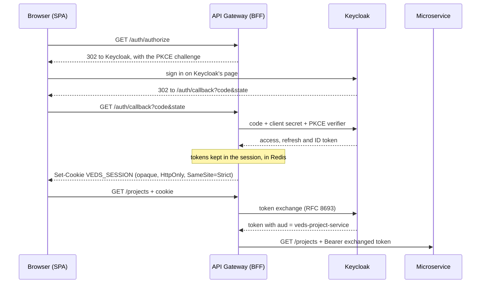

# Keycloak Configuration

## How It Works

Keycloak is the identity provider (IdP) for the application. It handles:

- User credentials storage (passwords, enabled/disabled state).
- Token issuance (access tokens + refresh tokens, JWT format).
- Role management (mirrored from the app's IAM service).

> [!IMPORTANT]
>
> The realm JSON export: `keycloak/realm-config/realm-export.json` is automatically imported **on first startup** via
> Docker Compose volume mount. You do **not** need to configure Keycloak manually. An existing realm is never
> re-imported: to load a changed export locally, remove the `veds_keycloak-postgres-data` volume and start Keycloak
> again.

## What the Realm Export Creates

| Resource                     | Name                           | Purpose                                                                                            |
|------------------------------|--------------------------------|----------------------------------------------------------------------------------------------------|
| Realm                        | `veds`                         | Application realm                                                                                  |
| Realm roles                  | `USER`, `ADMIN`                | Mapped to Spring Security `ROLE_USER`, `ROLE_ADMIN`                                                |
| Client                       | `veds-api-gateway`             | Confidential client used by the Gateway BFF; standard token exchange enabled                       |
| Client                       | `veds-service-account`         | Service account for IAM backend admin operations                                                   |
| Clients                      | `veds-<name>-service`          | One per service behind the gateway: the audience of a token exchanged for it; no flow of their own |
| Client scopes (optional)     | `veds-<name>-service-audience` | On the gateway client; each adds one service to the `aud` of an exchanged token                    |
| Protocol mapper (predefined) | `roles mapper`                 | Puts realm roles into `realm_access.roles` claim in access token                                   |
| Protocol mapper (predefined) | `email mapper`                 | Puts `email` claim in access token                                                                 |
| Protocol mapper              | `veds-api-gateway-audience`    | Puts `veds-api-gateway` in the `aud` claim of the gateway's own access tokens                      |
| Required action (default)    | `TERMS_AND_CONDITIONS`         | A new account accepts the terms before its first sign-in ends                                      |
| User profile attribute       | `terms_and_conditions`         | When the terms were accepted; admins only                                                          |

The terms text (`termsTitle`, `termsText`, Polish and English) links FastDo's `/terms` and `/privacy-policy` pages, and
Keycloak stores the time of acceptance in `terms_and_conditions`. The attribute is declared in the user profile, because
Keycloak 26 drops attributes the profile does not declare. The realm also sets a password policy (`length(8)`, not the
e-mail, not the username) and offers its pages in Polish and English.

## Authentication Flow — Token Handler (BFF) with Authorization Code + PKCE

**No token of any kind reaches the browser.** The SPA holds one opaque HttpOnly cookie; the gateway keeps the access and
refresh tokens in its session in Redis and, on the way through to a microservice, injects `Authorization: Bearer` with a
token exchanged for that service alone. The OAuth2 work — state, PKCE, the code exchange, the ID token check, the
refresh and the token exchange — is Spring Security's OAuth2 client.



1. **`GET /auth/authorize`** — Spring builds the authorization request (`state`, `nonce`, `code_verifier`), keeps it in
   an encrypted short-lived cookie and redirects to Keycloak with `code_challenge = S256(code_verifier)`.
2. **`GET /auth/callback`** — Spring checks `state`, exchanges the code as a *confidential* client (client secret
   **and** PKCE verifier), validates the ID token and opens a server-side session.
3. **`GET /auth/session`** — the SPA's bootstrap call: "am I logged in, and as whom?". Returns id, e-mail and
   roles, or **`204`** when nobody is. Not being signed in is an answer, not a refusal: a `401` here would be
   indistinguishable from the session store being unreachable, and the SPA would sign the person out over a
   network blip.
   Never a token.
4. **`POST /auth/logout`** — revokes the refresh token at Keycloak and deletes the session.

Each microservice still validates the JWT independently against Keycloak's JWKS endpoint — they are unaware a browser
session ever existed — and accepts only a token whose audience is its own client, `veds-${spring.application.name}`
(`shared-web-config.yml`).

### Mechanisms

| Mechanism                                                                | Where it runs |
|--------------------------------------------------------------------------|---------------|
| [Session](../api-gateway/docs/mechanisms/session.md)                     | api-gateway   |
| [Token exchange](../api-gateway/docs/mechanisms/token-exchange.md)       | api-gateway   |
| [Token refresh](../api-gateway/docs/mechanisms/token-refresh.md)         | api-gateway   |
| [User provisioning](../iam-service/docs/mechanisms/user-provisioning.md) | iam-service   |
| [Second factor](../iam-service/docs/mechanisms/second-factor.md)         | iam-service   |

### Why the full Token Handler, not just PKCE plus a token in the response

Handing the SPA an access token — even with the refresh token safely in a cookie — leaves that access token in
JavaScript memory.

|                                           | Token in the SPA       | Token Handler                            |
|-------------------------------------------|------------------------|------------------------------------------|
| XSS can exfiltrate a usable token         | yes                    | no — only an HttpOnly cookie exists      |
| Token in JS memory / `localStorage` / URL | yes                    | no                                       |
| Revoking a session takes effect           | when the token expires | immediately — delete the Redis record    |
| SPA implements a refresh loop             | yes                    | no — the gateway refreshes transparently |

### What lives where

| Concern                                               | Owner           |
|-------------------------------------------------------|-----------------|
| Passwords, sessions, MFA, token issuance, realm roles | **Keycloak**    |
| Acceptance of the terms                               | **Keycloak**    |
| Browser session ↔ token mapping                       | **api-gateway** |
| Profile, settings, role mirror                        | **iam-service** |

Profile data is deliberately *not* stored in Keycloak user attributes: it is not an application database and querying it
is painful. The Admin API stays, in the narrower role of provisioning users at registration and syncing roles.

## Configuration

All Keycloak-related config is centralized in `shared-web/src/main/resources/shared-web-config.yml` and injected
into each service via `KeycloakProperties`.

## Where Do Role Names Live? (Microservices Anti–Shared-Kernel)

Role names are owned by **two places only**:

| Location           | Details                                                                                                                                                                                                                                                                                                        |
|--------------------|----------------------------------------------------------------------------------------------------------------------------------------------------------------------------------------------------------------------------------------------------------------------------------------------------------------|
| **Keycloak realm** | (`keycloak/realm-config/realm-export.json`) — the runtime source of truth issued in every access token's `realm_access.roles` claim.                                                                                                                                                                           |
| **iam-service**    | (`iam-service/.../domain/model/RoleType.kt`, `internal`) — a type-safe mirror used solely by the role *administrator* (`RoleInitializer` seeds the DB, `AuthService.register` assigns `USER` via the Keycloak Admin API). The enum is `internal` to the iam-service module and intentionally **not** exported. |

> [!NOTE]
>
> Other microservices **do not** depend on iam-service's enum. They check roles as plain strings.

**Why no `shared-web.RoleType` enum:**

| Reason                        | Explanation                                                                                                                              |
|-------------------------------|------------------------------------------------------------------------------------------------------------------------------------------|
| **Shared Kernel Antipattern** | (DDD antipattern, Evans, *DDD* ch. 14) — every change to the role vocabulary would force a coordinated recompile/deploy across services. |
| **Bounded Context Conflict**  | A role's *meaning* (what `ADMIN` is allowed to do) belongs to the service that owns the resource, not to a global enum.                  |
| **Source of Truth Drift**     | The IdP is already the source of truth; an in-code mirror would inevitably drift from Keycloak.                                          |

> [!NOTE]
>
> What stays in `shared-web/security/` is **only** the technical JWT → `Authentication` adapter
> (`KeycloakJwtAuthenticationConverter` / `ReactiveKeycloakJwtAuthenticationConverter`). It is role-name-agnostic — it
> maps *whatever* strings sit in the configured claim path onto `ROLE_*` authorities. Each service then decides which of
> those it cares about, in its own `SecurityConfig`.

## Useful Keycloak URLs (Local Dev)

| URL                                                                | Description                             |
|--------------------------------------------------------------------|-----------------------------------------|
| http://localhost:9000                                              | Keycloak admin console                  |
| http://localhost:9000/realms/veds/.well-known/openid-configuration | OpenID Connect discovery                |
| http://localhost:9000/realms/veds/protocol/openid-connect/certs    | JWKS (public keys for JWT verification) |
| http://localhost:9000/realms/veds/protocol/openid-connect/token    | Token endpoint                          |

## Manual Token Request (curl)

```bash
# Get access token
curl -s -X POST http://localhost:9000/realms/veds/protocol/openid-connect/token \
  -H "Content-Type: application/x-www-form-urlencoded" \
  -d "grant_type=password" \
  -d "client_id=veds-api-gateway" \
  -d "client_secret=KEYCLOAK_GATEWAY_CLIENT_SECRET_HERE" \
  -d "username=test@example.com" \
  -d "password=Test1234!" | jq .
```

## Production TLS

`application-prod.yml` assumes TLS on every hop. Defaults are set for an ingress that terminates TLS in front of the
gateway; flip `SERVER_SSL_ENABLED` when a process holds the certificate itself.

| Leg                       | Setting                                                                                          |
|---------------------------|--------------------------------------------------------------------------------------------------|
| Browser → ingress/gateway | `SERVER_SSL_ENABLED`, `SERVER_SSL_BUNDLE`                                                        |
| Ingress → gateway         | `forward-headers-strategy: framework` (keeps the https scheme in redirect URIs and `Set-Cookie`) |
| Gateway → Redis           | `spring.data.redis.ssl.enabled=true`, `REDIS_SSL_BUNDLE`                                         |
| Service → PostgreSQL      | `DB_SSL_MODE=verify-full`, `DB_SSL_ROOT_CERT`                                                    |
| Service → Kafka           | `KAFKA_SECURITY_PROTOCOL=SASL_SSL`, SCRAM-SHA-512, truststore                                    |
| Cookie flag               | `application.shared.keycloak.cookie.secure: true` (hardcoded, not overridable)                   |

Two choices worth stating:

- **`verify-full`, not `require`, for PostgreSQL.** `require` encrypts but accepts any certificate, so it stops passive
  sniffing and not an active man-in-the-middle.
- **`ssl.endpoint.identification.algorithm: https` for Kafka.** The default in some setups is empty, which disables
  hostname verification and reintroduces the same gap.
- **`forward-headers-strategy` only behind a trusted proxy.** It makes the application believe `X-Forwarded-*`, so it
  must stay off wherever something untrusted can set those headers.
- **`server.ssl.enabled` only when TLS terminates in the process.** With an ingress holding the certificate it stays
  off; turning it on there gives a service talking TLS to a proxy that already did.

The `Secure` cookie flag is fixed to `true` in prod rather than read from an environment variable: a session cookie
without it can be sent over plain http and captured, and that is not a knob worth having.
